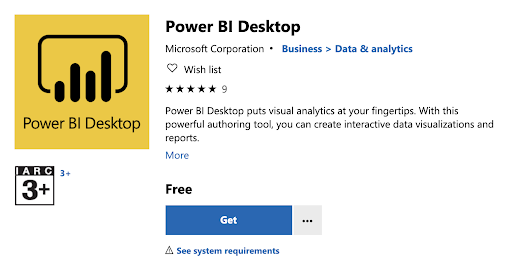
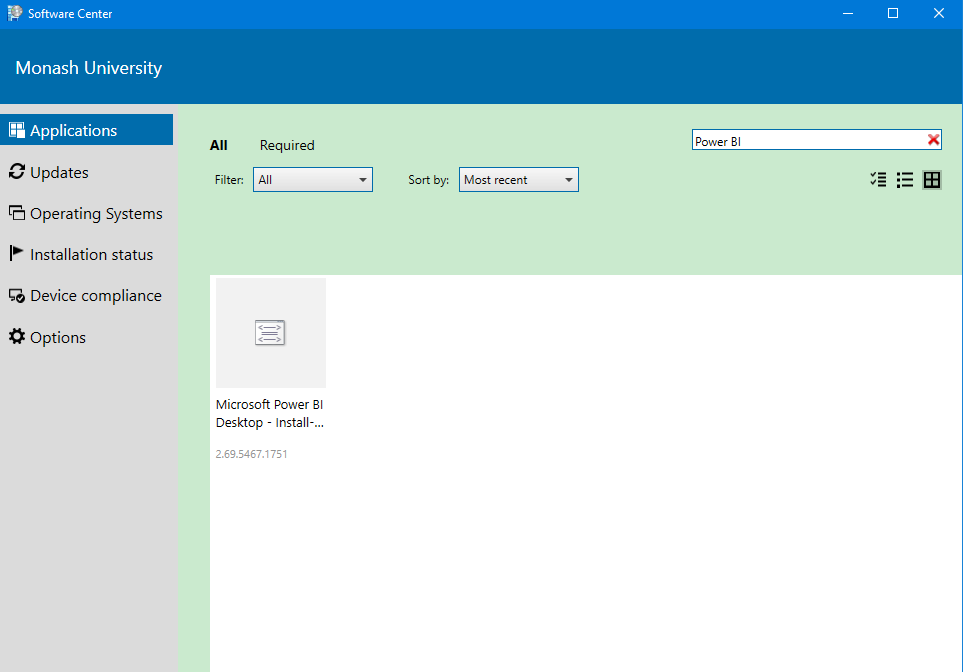
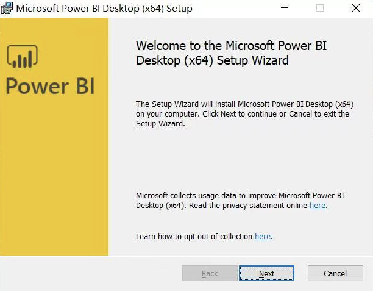
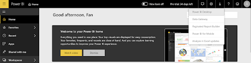
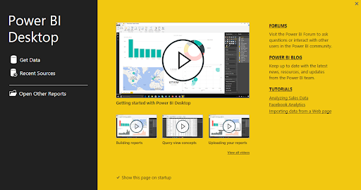

# Setup {#index -}

```{r, include = FALSE}
knitr::opts_chunk$set(fig.width=6, fig.height=3.5, fig.align="center")
```

```{r echo=F,out.width="25%",fig.align="left"}
knitr::include_graphics("figures/powerbi.png")
```

These are the course notes for the "Introduction to Power BI" course given by the [Monash Bioinformatics Platform](https://www.monash.edu/researchinfrastructure/bioinformatics) for the [Monash Data Fluency](https://monashdatafluency.github.io/) initiative. Our teaching style is based on the style of [The Carpentries](https://carpentries.org/). 

* [PDF version for printing](https://github.com/MonashDataFluency/Power_BI/raw/master/docs/powerbi-intro.pdf)
* [ZIP of data files used in this workshop](https://github.com/MonashDataFluency/Power_BI/raw/master/docs/powerbi-files.zip)

During this workshop we will be using Power BI Desktop installed on your computer. There are several ways to download Power BI Desktop, depending on which system you use.

**1. Windows** 

* **Windows Store**

The first option is to visit Windows Store to get the [Power BI Desktop app](https://www.microsoft.com/en-au/p/power-bi-desktop/9ntxr16hnw1t?activetab=pivot:overviewtab) and install it. Note that the system requirements is Windows 10 version 14393.0 or higher. 

```{r, fig.align = 'center', out.width = "80%", echo = FALSE}

```

If you are using a Monash machine, try searching "**Power BI**" in "[Software Center](https://www.monash.edu/esolutions/software/install-software-on-monash-devices)" and install it. For questions concerning installation on a Monash machine, you may [contact eSolutions](https://www.monash.edu/esolutions/contact) for help. 

```{r, fig.align = 'center', out.width = "80%", echo = FALSE}

```

* **Power BI website**

You can also download Power BI Desktop from the [Power BI website](http://go.microsoft.com/fwlink/?LinkID=521662) and install it as an application on your computer. 

```{r, fig.align = 'center', out.width = "60%", echo = FALSE}

```

* **Power BI service**

Or if you prefer [Power BI Service](https://app.powerbi.com/home), you can get it by clicking the "**Download**" button in the upper right and selecting "**Power BI Desktop**". To use Power BI service, you may need to [sign in](https://powerbi.microsoft.com/en-us/landing/signin/) your Microsoft account. 

```{r, fig.align = 'center', out.width = "100%", echo = FALSE}

```

After the setup process, you will be able to see the following Start Screen. 

```{r, fig.align = 'center', out.width = "80%", echo = FALSE}

```

**2. MacOS**

Power BI Desktop is not available on Macs. However, you can run a Windows session on your Mac via [BootCamp](https://support.apple.com/en-au/HT201468) or using a similar application.

**3. Linux**

Currently it is not possible to install Power BI desktop on Linux. You can choose to install it on a Windows Virtual Machine like [VirtualBox](https://www.virtualbox.org/wiki/Downloads) or using a similar application.

After installing Power BI Desktop, you can sign up for Power BI using your Monash account [here](https://signup.microsoft.com/signup?sku=a403ebcc-fae0-4ca2-8c8c-7a907fd6c235&email=&ru=https%3A%2F%2Fapp.powerbi.com%3Fpbi_source%3Dweb%26redirectedFromSignup%3D1%26noSignUpCheck%3D1). By signing in the Power BI Desktop, you will be able to save your work and later publish it to the Power BI service.

### Data {-}

Download the data file [`gap-minder.csv`](https://raw.githubusercontent.com/MonashDataFluency/Power_BI/master/powerbi-files/gap-minder.csv) for the course. 

### Source code {-}

This book was created in R using the `rmarkdown` and `bookdown` packages.

* [GitHub page](https://github.com/MonashDataFluency/Power_BI)

### Authors and copyright {-}

This course is developed for the Monash Data Fluency Team.

```{r echo=F}
knitr::include_graphics("figures/CC-BY.png")
```

This work is licensed under a [CC BY-4: Creative Commons Attribution 4.0 International License](http://creativecommons.org/licenses/by/4.0/). The attribution is "Monash Bioinformatics Platform" if copying or modifying these notes.

Data files are derived from Gapminder, which has a CC BY-4 license. The attribution is "Free data from www.gapminder.org". Refer to the [Gapminder site](https://www.gapminder.org) for the original form of the data if using it for other uses.
