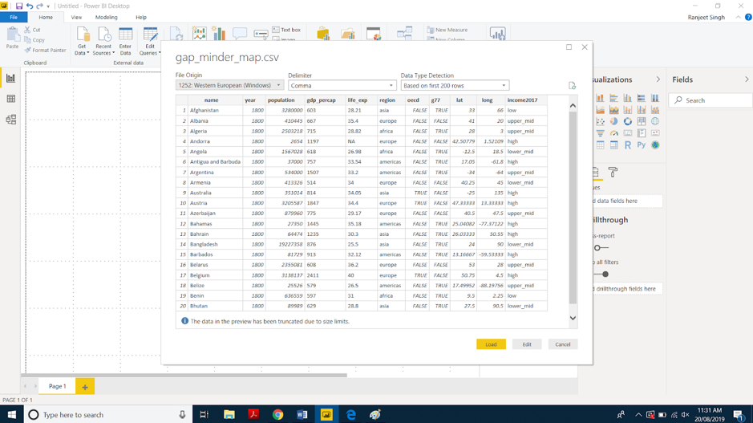
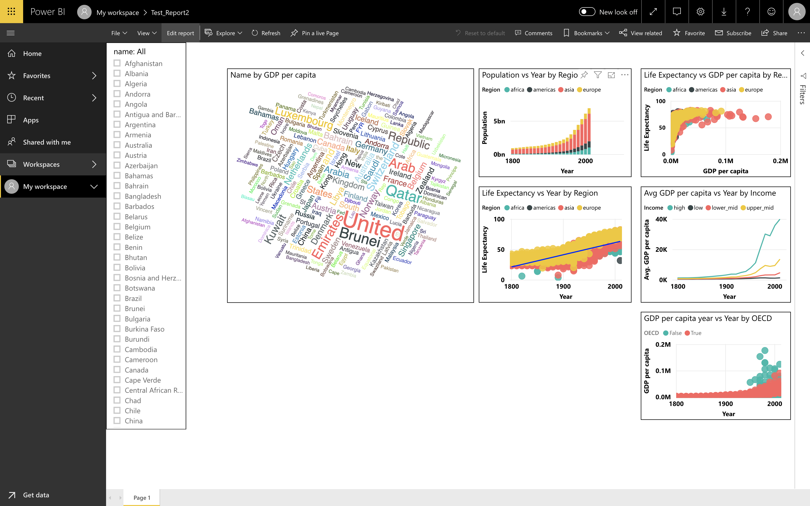
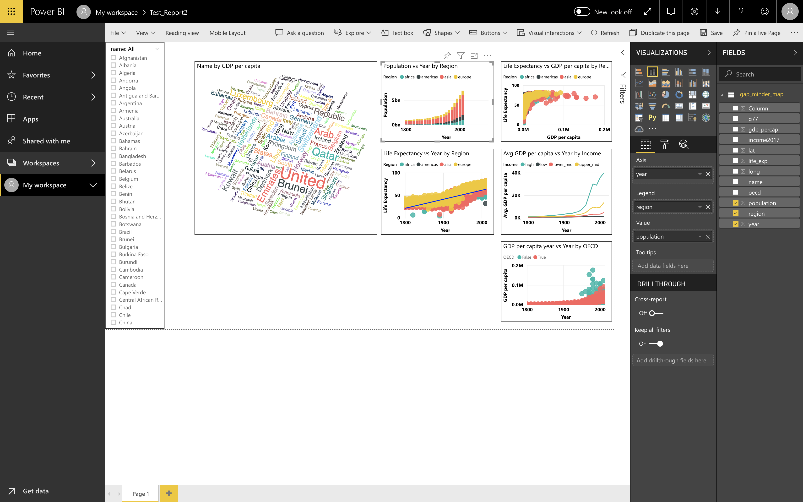

---
output:
  pdf_document: default
  html_document: default
---
# Introduction to PowerBI

## Overview of Power BI
Microsoft Power BI is a collection of apps, software services and connectors that come together to turn the unrelated data into visually impressive and interactive insights. Power BI can work with the simple data sources like Microsoft Excel and complicated ones like cloud-based or on-premises hybrid Data warehouses. Power BI has the capabilities to easily connect to your data sources, visualise and share and publish your findings with anyone and everyone. 

Power BI can be simple and fast enough to connect to an Excel workbook or a local database. It can also be robust and enterprise-grade, ready for extensive modeling and real time analytics. This means it can be a personal report and visualisation tool but can also act as the analytics and decision engine behind group projects, divisions, or entire corporations.

## The parts of Power BI
Power BI constitutes of a Microsoft Windows desktop application called Power BI Desktop, an online SaaS (Software as a Service) called Power BI Service and a mobile Power BI apps that can be accessed from Windows phones and tablets, and also available on Apple iOS and Google Android devices.

These three elements— **Desktop**, the **Service**, and **Mobile** apps - are the backbone of the Power BI system and lets users create, share and consume the actionable insights in the most effective way.

## Use of Power BI and roles
The use of Power BI could depend on the role that you are in. For example: if you are the stakeholder of a project, then you might want to use **Power BI Service** or the Mobile **app** to have a glance at how the business is performing. But on the other hand, if you are a developer, you would be using **Power BI Desktop** extensively to publish Power BI desktop reports to the Power BI Service. 

In the upcoming modules we would be discussing about these three components - **Desktop**, **Service** and **Mobile** apps - in more detail. 

## Power BI Flow
In the most general way, the flow starts at the Power BI Desktop, where a report is created. This created report can be published to the Power BI Service and finally shared so that the users can use it from the Mobile apps.

Its not always the case that this flow happens, but more often or not it is. We will stick to this flow for this entire tutorial to help learn the different aspects of Power BI.

## Use Power BI:
The **common** flow of activity in Power BI looks like this:
1. Bring data into Power BI Desktop, and create a report.
2. Publish to the Power BI service, where you can create new visualizations or build dashboards.
3. Share dashboards with others, especially people who are on the go.
4. View and interact with shared dashboards and reports in Power BI Mobile apps.

As mentioned earlier, depending on the user role, the user might spend its most of the time in one of the three components than the other. 

## Building blocks of Power BI:

The basic building blocks in Power BI are:
* Visualizations

* Datasets

* Reports

* Dashboards

* Tiles


### Visualizations
A visualization is a representation of data in a visual format. It could be a line chart, a bar graph, a color coded map or anything interesting to present the data. 

```{r echo=F,out.width="80%",fig.align="center"}
knitr::include_graphics("figures/ch04/bar_chart_pop_vs_year_by_region.png")
```

Visualizations can be simple as a number representing something significant or it could be quite complex like multiple stacked chart showing the proportion users participating in a survey. The main idea of visualisation is to show the data in a way that it tells the story that is lying underneath it. Like it is said, a picture says a thousand words. 

### Datasets:
A **dataset** is a collection of data that Power BI uses to create its visualizations.
You can have a simple dataset that's based on a single table from a Microsoft Excel workbook, similar to what's shown in the following image.

```{r, fig.align = 'center', out.width = "100%", echo = FALSE}

```

Dataset can also be a combination of many different sources, which can be filtered using Power BI and combined into one to use. 

For example: One data source could be the countries and location in the form of Latitude and Longitude. Another data source could be the demographics of these countries like: population, GDP etc. Power BI can combine these two data sources into one dataset which can be used for visualizations. 

An important feature of Power BI is the ability to connect to various data sources using its connectors. Whether the data you want is in Excel or a Microsoft SQL Server database, in Azure or Oracle, or in a service like Facebook, Salesforce, or MailChimp, Power BI has built-in data connectors that let you easily connect to that data, filter it if necessary, and bring it into your dataset.

After you have a dataset, you can begin creating visualizations that show different portions of it in different ways, and gain insights based on what you see. That is where reports come in.

### Reports:
In Power BI, a **Report** is a collection of visualizations that appear together on one or more pages. A report in Power BI is a collection of items that are related to each other. The following image shows a report that you will be creating by the end of the session. You can also create reports in the Power BI service.

```{r echo=F,out.width="100%",fig.align="center"}

```

Reports let us create and structure visualizations on pages based on the way the we want to tell the story. 

### Dashboards:
A Power BI dashboard is a collection of visuals from a single page that you can share with others. Often it is a selected group of visuals that provide quick insight into the data or story you are trying to present.

A dashboard must fit on a single page, often called a canvas (the canvas is the blank backdrop in Power BI Desktop or the service, where you put visualizations). Think of it like the canvas that an artist or painter uses — a workspace where you create, combine, and rework interesting and compelling visuals. You can share dashboards with other users or groups, who can then interact with your dashboards when they're in the Power BI service or on their mobile device.

## Power BI Services:

### Overview of Power BI Desktop
Power BI Desktop is a free application for PCs that lets you gather, transform, and visualize your data. In this module, you'll learn how to find and collect data from different sources and how to clean or transform it. You'll also learn tricks to make data-gathering easier.
Power BI Desktop and the Power BI Service work together. You can create your reports and dashboards in Power BI Desktop, and then publish them to the Power BI Service for others to consume.

```{r echo=F,out.width="100%",fig.align="center"}

```

1. **Ribbon** - Displays common tasks that are associated with reports and visualizations.

2. **Report view, or canvas** - Where visualizations are created and arranged. You can switch between **Report**, **Data**, and **Model** views by selecting the icons in the left column.

3. **Pages tab** - Located along the bottom of the page, this area is where you would select or add a report page.

4. **Visualizations pane** - Where you can change visualizations, customize colors or axes, apply filters, drag fields, and more.

5. **Fields pane** - Where query elements and filters can be dragged onto the **Report** view or dragged to the **Filters** area of the Visualizations pane.


