# Plotting

<!--
## Import data set
Load the `gap_minder_map.csv` file in PowerBI desktop

Click on "**Get Data**" dropdown icon, and go to Text/CSV option; a dialog box will appear. 

```{r echo=F,out.width="25%",fig.align="center"}
knitr::include_graphics("figures/powerbi.png")
```

--picture-- 

--picture--

Locate your file and click "**Open**".

--picture--

Another dialog box will appear where you can see the contents of your file. Click on Load icon to "**Load**" the file in your Power BI Desktop.

--picture--

--picture--

--picture--

--picture--

Once you have loaded the file, you will not see the contents automatically. You need to click on "**Edit Query**" icon under the Home tab in the taskbar to visualize the contents of your file. This will open a new window that looks like an Excel sheet.


--TODO
Replace image with gapminder data.
Numerical data has ∑ symbol.
-->
In the previous chapter, we saw how to import data into Power BI. We also did some basic pre-processing of data like cleaning the data, changing the type of data, dealing with null and error values. In this section, we are going to work with our already processed data.


## Visualizations Panel

We touched upon the different panels present in the Power BI interface. Now, we will explore the different panels dedicated to creating and formatting charts in detail.
One of the panels is the Visualization panel highlighted in the Red box. It contains various types of charts that you can create to visualize your data. Some of the available chart types are - Stacked bar chart, Line chart, Area chart, Scatter plot, Pie chart, etc. You can also import a custom visual from a file or the marketplace if you click on the **…** icon. We will explore that in the later section. 


<!--picture--->
```{r echo=F,out.width="100%",fig.align="center"}
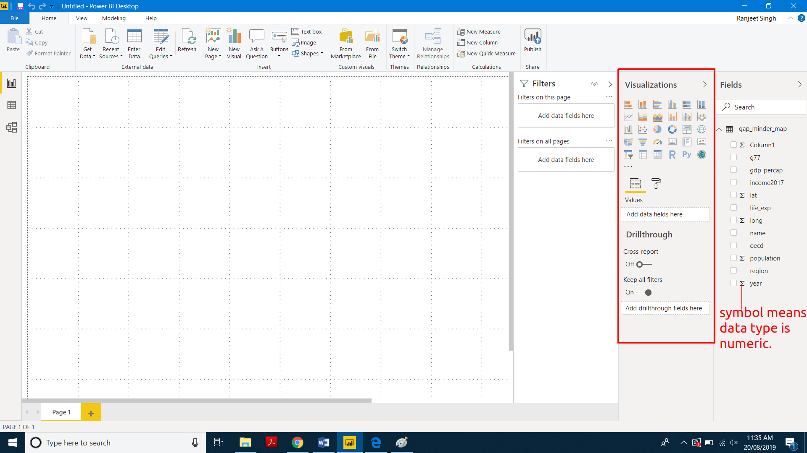
```


### Scatter plot

Let's create our first chart - Scatter plot. The first step to plot any kind of plot in Power BI is to select the plot template/type from the visualization panel. So, we click on the scatter chart icon in the visualization panel and drag the columns to the respective -Axis field as shown in the below figure.

<!--picture--->
```{r echo=F,out.width="60%",fig.align="center"}
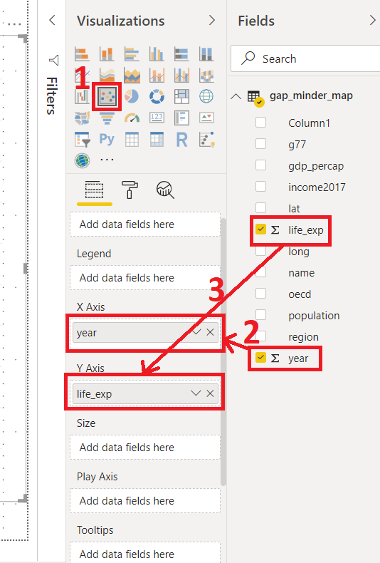
```

We want to see how life expectancy (life_exp) varies with time (year) in years.
After dragging the columns to their respective fields, we get out first scatter plot.
An overall increasing trend can be seen after year 1900.

<!--picture---> 
```{r echo=F,out.width="80%",fig.align="center"}
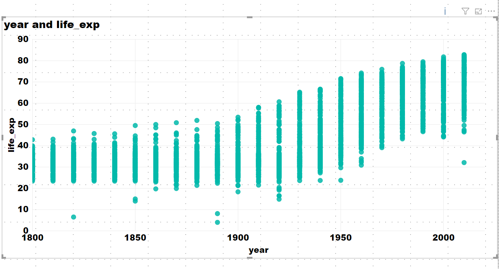
```

The final interface will look like the image below. The plot will be at the left of the visualization panel.

<!--picture--->
```{r echo=F,out.width="100%",fig.align="center"}
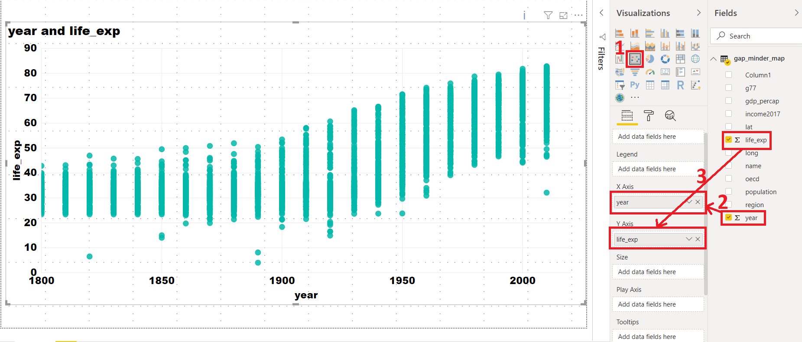
```

In general, this will be the procedure to create any type of plot the Power BI i.e., Select the chart type from the visualization section, drag data to the -Axis fields.

The above scatter plot is not informative. The only information we get is the general trend of life expectancy, which increases after year 1900.
Let's play with our scatter plot to make it more informative:

    X-Axis: year

    Y-Axis: life_exp. Right-click on drop-down button and select "**Don’t summarize**" option.

    Legend: By name. Drag name column and place it in legend field.

```{r echo=F,out.width="80%",fig.align="center"}
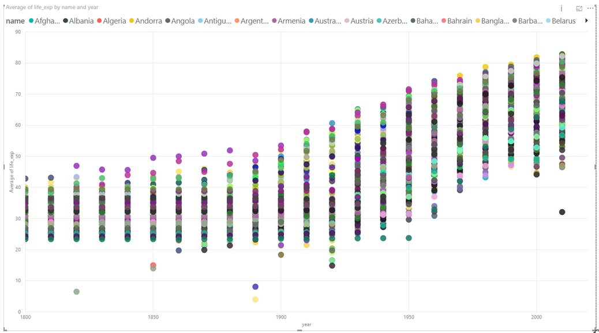
```
Here, we have colored each dot by the country. This plot shows the trend of life expectancy for **each country** with years.
Since there are so many countries in our data, this plot looks messy, unclear and our plot legend "explodes".

Let's see if we can make this better.

Use the following parameters to create your chart:

    X-Axis: year
    Y-Axis: life_exp. Right-click on drop-down button and de-select "**Don’t summarize**" option.
    Legend: By region

```{r echo=F,out.width="80%",fig.align="center"}
knitr::include_graphics("figures/ch04/scatter_plot_3_by_region.png")
```
Here, we color each data point by the region in which the countries lie. The `summarize` option summarizes the life expectancy (life_exp) for each region.

*PowerBI automatically summarizes the numerical data. Always be careful with that.*

**Activity:** In the same chart, try the following:
Size: By population
Report what follows.


### Challenge 1:{.challenge}
####Scatter plot:
Keep the summarize option ON. Create a chart with the following options: 

    X-Axis: year

    Y-Axis: life_exp

    Legend: By region

Explain the chart.
 
Click on the dropdown menu and select "**Average**" and explain the difference.

**Solution1:**
Computes the sum of life_Exp in all countries in a given region, and plots it.
Computes the average of life_Exp in all countries in a given region, and plots it.


```{r echo=F,out.width="100%",fig.align="center"}
knitr::include_graphics("figures/ch04/challenge01.png")
```

### Line Chart

Let's select a line chart from the visualization panel. Drog and drop following columns:

    Axis: Year
    Values: Life_exp
    Legend: By name

```{r echo=F,out.width="80%",fig.align="center"}
knitr::include_graphics("figures/ch04/linechart_life_exp_vs_year_by_name.png")
```

We get differently colored lines for each country. Now try changing the Legend to `by region`.

    Axis: Year
    Values: Average of Life_exp. Select "**Average"**
    Legend: By region

```{r echo=F,out.width="80%",fig.align="center"}
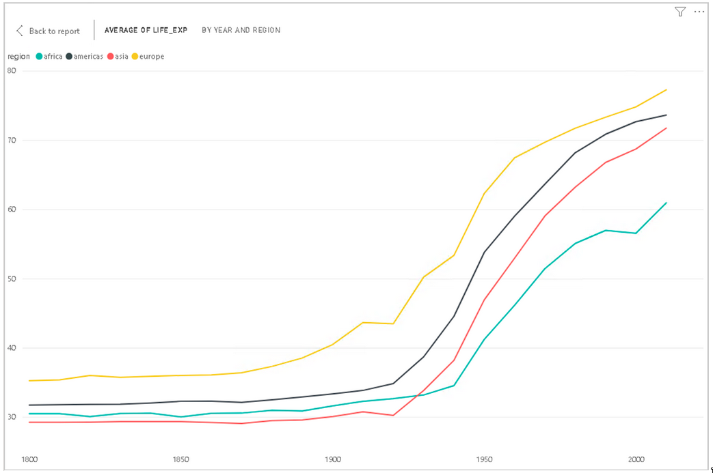
```

Power BI computes average of Life expectancy for countries in each region and shows four average lines corresponding to four regions.


### Bar Plots

Select the bar chart from the Visualization panel and drag the following columns:

    Axis: Year
    Values: Population 
    Legend: By region


```{r echo=F,out.width="80%",fig.align="center"}
knitr::include_graphics("figures/ch04/bar_chart_pop_vs_year_by_region.png")
```
This bar plot shows population variation over time (in years) for all 4 regions.

### Trends and analytics in plots

Up till now we have been working in the **Details** tab of the **Visualizations pane**. There are two other useful tabs, **Format** and **Analytics**. Let's have a look at **Analytics**

This tab allows you to add different reference lines to your visualization which can help the user determine trends and insights in the data. Click on the line chart that you have created. Select the **Analytics** tab.

```{r echo=F,out.width="80%",fig.align="center"}
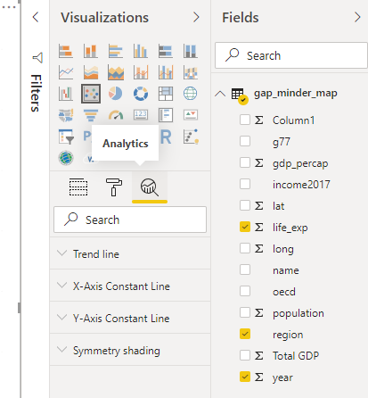
```

Here you can add reference lines for various measures. Click add a trend line to your chart.

These options will vary depending on the chart that you use.

```{r echo=F,out.width="80%",fig.align="center"}
knitr::include_graphics("figures/ch04/trend_life_exp_vs_year_by_region.png")
```

## Plot modifications

Another important part about visualizing and telling the story of your data is the design and format of your visualizations. This is where we will use the **Format** tab.

Click on your scatter chart and click the **Format** tab to see the variety of options available to make your visualization more readable and understandable. 

A common issue is the default titles of charts. This will usually use the names of the data columns which is often meaningless to the average user. Click on **Title** and change it to a clearer name like 'Regional average life expectancy since 1800'. You can also edit the legend or axis labels. Let's make the axis labels more clear. Change the font for the x and y axis to Segoe(Bold), increase the font size to 12 and color to black.

```{r echo=F,out.width="80%",fig.align="center"}
knitr::include_graphics("figures/ch04/format.png")
```

The options available will be different for each visualization. Using these options will greatly increase the engagement and understanding of your visuals.
<!-- Filter data
Beautify plots:
Font- Segoe(Bold)
Font size: 12
Font color: Black
Slicer:
	By year
	By country (challenge) -->

## Filters

Filters are a powerful way to break down and show specific parts of the data. You can access the **Filters pane** through clicking **Filters**.

```{r echo=F,out.width="60%",fig.align="center"}
knitr::include_graphics("figures/ch04/filters.png")
```

You can filter data for individual visualizations, pages and for the entire report.

For Bangladesh

```{r echo=F,out.width="60%",fig.align="center"}
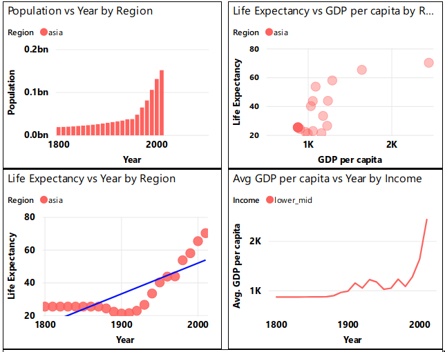
```

For Bangladesh and Brazil

```{r echo=F,out.width="80%",fig.align="center"}
knitr::include_graphics("figures/ch04/bangladesh_and_brazil.png")
```


### Challenge 3: Scatter Plot {.challenge}
**A:** Create a scatter-plot of this with:

    gdp_percap as x.
    life_exp as y.
    population as the size.
    region as the label.

```{r echo=F,out.width="80%",fig.align="center"}
knitr::include_graphics("figures/ch04/challenge3a.png")
```


**B:**  Filter the data for year-2010 only.

**C:** Use the slicer to visualize data for different countries
	For all countries

```{r echo=F,out.width="80%",fig.align="center"}
knitr::include_graphics("figures/ch04/challenge3c.png")
```

## Explore Marketplace for other visualizations

The visualizations we have been using are part of the default offerings in Power BI. There are many more visualisations available in the marketplace. To import a new visualisation template from the marketplace, click on the icon "**(...)**", i.e. three horizontal dots in the visualization panel then click on import from the marketplace.


```{r echo=F,out.width="60%",fig.align="center"}
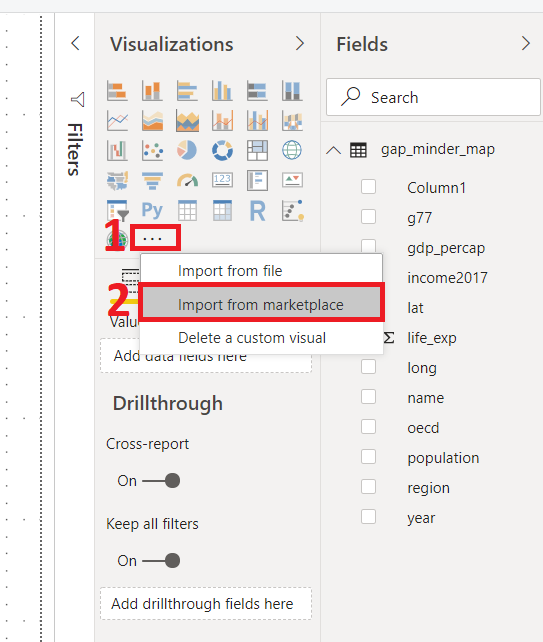
```


This will pop a new window, where you can search for various types of templates. For example, we are looking for the Word Cloud template. Type Word Cloud in the search box, once you find the template click on the "**Add icon**" then it will added to the visualization panel. 


```{r echo=F,out.width="100%",fig.align="center"}
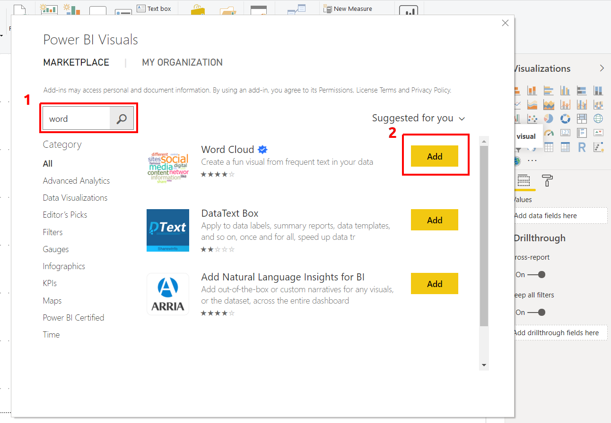
```


### Challenge 4: Create a Word Cloud for countries by GDP per capita {.challenge}

####Word Cloud

a) Create a plot that compares GDP per capita for each country

    Category: name
    Values: GDP per capita
    
b) Filter this for the year 2010.

c) Use a slicer with years

```{r echo=F,out.width="100%",fig.align="center"}
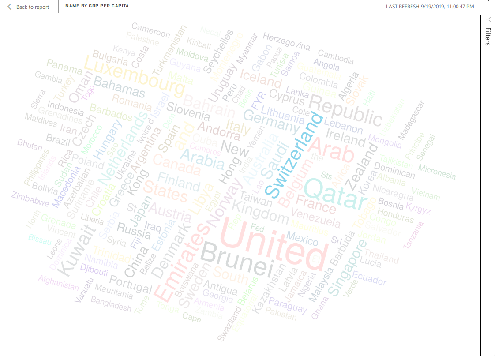
```

### Map chart
We need Latitude (lat) and Longitude (long) values to create a Map chart. For this, we use following parameters:

    Size: Population
    Colour: Income level

```{r echo=F,out.width="80%",fig.align="center"}
knitr::include_graphics("figures/ch04/geo_map.png")
```

This plot tells us if a country is one of the four- high income, upper-middle income, lower-middle income or low income country by the color of the bubbles. The color correspondence to these categories can be seen in the legend at the top of the chart. It also indicates the population size of each country by the size of bubble. Bigger the bubble, higher the population of the country.