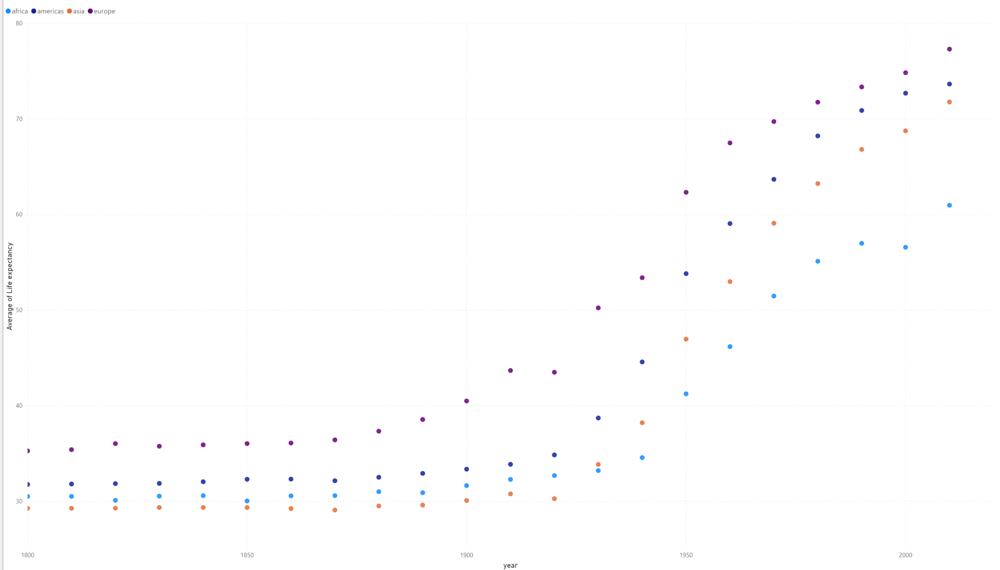
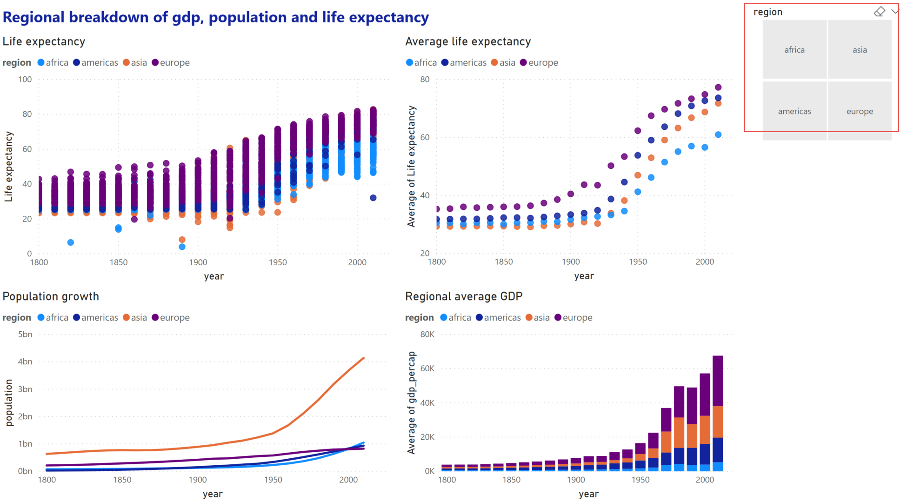

# Plotting

<!--
## Import data set
Load the `gap_minder_map.csv` file in PowerBI desktop

Click on "**Get Data**" dropdown icon, and go to Text/CSV option; a dialog box will appear. 

```{r echo=F,out.width="25%",fig.align="center"}
knitr::include_graphics("figures/powerbi.png")
```

--picture-- 

--picture--

Locate your file and click "**Open**".

--picture--

Another dialog box will appear where you can see the contents of your file. Click on Load icon to "**Load**" the file in your Power BI Desktop.

--picture--

--picture--

--picture--

--picture--

Once you have loaded the file, you will not see the contents automatically. You need to click on "**Edit Query**" icon under the Home tab in the taskbar to visualize the contents of your file. This will open a new window that looks like an Excel sheet.


--TODO
Replace image with gapminder data.
Numerical data has ∑ symbol.
-->
In the previous chapter, we saw how to import data into Power BI. We also did some basic pre-processing of data like cleaning the data, changing the type of data, and dealing with null and error values. In this section, we are going to work with our already processed data.


## Visualization Panel

We touched upon the different panels present in the Power BI interface. We will now explore the different panels dedicated to creating and formatting charts in detail.
One of the panels is the **Visualization panel** highlighted in the Red box. It contains various types of charts that you can create to visualize your data. Some of the available chart types are - Stacked bar chart, Line chart, Area chart, Scatter plot, Pie chart, etc. You can also import a custom visual from a file or the marketplace if you click on the **…** icon. We will explore that in the later section. 


<!--picture--->
```{r echo=F,out.width="100%",fig.align="center"}
knitr::include_graphics("figures/ch03/visualization_panel.png")
```


### Scatter plot

Let's create our first chart, a Scatter plot. The first step to plot any kind of plot in Power BI is to select the plot template/type from the **Visualization panel**. Click on the scatter chart icon in the visualization panel and drag the columns to the respective -Axis field as shown in the below figure.

<!--picture--->
```{r echo=F,out.width="60%",fig.align="center"}
knitr::include_graphics("figures/ch03/scatter_plot_1.png")
```

We want to see how life expectancy `life_exp` varies with time `year` in years.
After dragging the columns to their respective fields, we get our first scatter plot.

This plot does not seem entirely correct.

### {.tip -}

* Click the drop down on both `life_exp` and `year` fields. These fields are being automatically summed.
* Click don't summarize.

### {-}

*PowerBI automatically summarizes numerical data. Be aware and check this when you add new numerical data to visualization fields.*

An overall increasing trend can now be seen after year 1900.

<!--picture---> 
```{r echo=F,out.width="80%",fig.align="center"}
knitr::include_graphics("figures/ch03/scatter_plot_2.png")
```

The final interface will look like the image below. The plot will be at the left of the **Visualization panel**.

<!--picture--->
```{r echo=F,out.width="100%",fig.align="center"}
knitr::include_graphics("figures/ch03/scatter_plot_3.png")
```

In general, this will be the procedure to create any type of plot in Power BI i.e. select the chart type from the **Visualization panel** and then drag data to the relevant fields.

The above scatter plot is not informative. Let’s explore what else we can do with this plot.

    X-Axis: year

    Y-Axis: life_exp

    Legend: country

```{r echo=F,out.width="80%",fig.align="center"}
knitr::include_graphics("figures/ch03/scatter_plot_2_by_country.png")
```
We have colored each dot by the country. This plot shows the trend of life expectancy for **each country** with years.
Since there are so many countries in our data, this plot looks messy, unclear and our plot legend "explodes".

Let's make this better.

Use the following parameters to create your chart:

    X-Axis: year
    Y-Axis: life_exp
    Legend: region

```{r echo=F,out.width="80%",fig.align="center"}
knitr::include_graphics("figures/ch03/scatter_plot_3_by_region.png")
```
This plot colors each data point by the region where the country is located. The **summarize** option summarizes the life expectancy `life_exp` for each region.

### {.tip -}
In the same chart, try the following:

+ Size: By `population`
+ Report what follows.

### {-}


### Challenge 1 Scatter plot{.challenge -}
Create a chart with the following options: 

    X-Axis: year

    Y-Axis: life expectancy

    Legend: By region
 
Find the **Average** life expectancy of each region by year.

### Challenge 1: Solution {.challenge -}

This shows the average of `life expectancy` in all countries in a given region, and plots it.


```{r echo=F,out.width="100%",fig.align="center"}

```

### Bar plot

Select the bar chart from the **Visualization panel** and drag the following columns:

    Axis: Year
    Value: GDP per capita
    Legend: By region


```{r echo=F,out.width="80%",fig.align="center"}

```
This bar plot shows GDP per capita variation over time (in years) for all 4 regions.

### Line chart

Select a line chart from the **Visualization panel**. Drag and drop the following columns:

    Axis: Year
    Values: Life_exp
    Legend: By name

```{r echo=F,out.width="80%",fig.align="center"}

```

We get differently colored lines for each country. Now try changing the Legend to `by region`.

    Axis: Year
    Values: Average of Life_exp. Select Average
    Legend: By region

```{r echo=F,out.width="80%",fig.align="center"}
knitr::include_graphics("figures/ch03/linechart_avg_life_exp_vs_year_by_region.png")
```

Power BI computes average of Life expectancy for countries in each region and shows four average lines corresponding to four regions.

### Changing visualizations

As you can see from your line chart, this uses the same data as your scatter plot but presented in a different visual format. Instead of making a new seperate visualization to do a different visual style, you can edit and change existing visualizations easily with Power BI. 

For the current line chart, select the visual and try selecting different visualizations on the **Visualization panel**. Visualizations with similar structures to your existing visual, like bar charts, will change over seamlessly. A slightly different visualization like a scatter plot might require some testing with the **Fields** in the **Fields** tab. 

### {.tip -}

* Change your line chart to a scatter plot. 
* Drag `life_exp` to the y-axis and `Year` to the x-axis 

### {-}
    
This should now be identical to your first scatter plot.

As you may have noticed, dragging and dropping **Fields** into the **Fields** tab will automatically change the data visualization. You can easily swap or add new fields using the drag and drop to change and discover new ways to visualize your data. You can remove fields by clicking the x next to the name.

### Challenge 2: Line chart {.challenge -}
As the line chart is showing the same information as an existing visualization, change the chart to show population instead of average life expectancy.

### Challenge 2: Solution {.challenge -}
```{r echo=F,out.width="80%",fig.align="center"}

```

### Trends and analytics in plots

Up till now we have been working in the **Fields** tab of the **Visualizations panel**. There are two other useful tabs, **Format** and **Analytics**. Let's have a look at **Analytics**.

This tab allows you to add different reference lines to your visualization which can help the user determine trends and insights in the data. Click on the scatter plot that you have created. Select the **Analytics** tab.

```{r echo=F,out.width="60%",fig.align="center"}
knitr::include_graphics("figures/ch03/analytics_tab.png")
```

Here you can add reference lines for various measures. Add a trend line to your chart.

These options will vary depending on the chart that you use.

```{r echo=F,out.width="80%",fig.align="center"}
knitr::include_graphics("figures/ch03/trend_life_exp_vs_year_by_region.png")
```

## Plot modifications

An important aspect of visualizing and telling the story of your data is the design and format of your visualizations. This is where we will use the **Format** tab.

Click on your scatter chart you created for Challenge 2. 
Click the **Format** tab to see the variety of options available to make your visualization more readable and understandable. 

A common issue is the default titles of charts. This will usually use the names of the data columns which is often meaningless to the average user. 

### {.tip -}
* Click on **Title** and change it to a clearer name like 'Regional average life expectancy since 1800'. 

You can also edit the legend or axis labels. Let's make the axis labels more clear.

* Change the font for the x and y axis to Segoe(Bold), increase the font size to 12 and color to black.

### {-}

```{r echo=F,out.width="60%",fig.align="center"}
knitr::include_graphics("figures/ch03/format.png")
```

The options available will be different for each visualization. Using these options will greatly increase the engagement and understanding of your visuals. Let's go and change the names of all the other visuals to something more meaningful.

### Challenge 3: Scatter Plot {.challenge -}
Let's say you think there might be a correlation between GDP per capita and life expectancy. Try creating a scatter plot showing the comparison between these two value split by region.

### Challenge 3: Solution {.challenge -}
+ `gdp_percap` as x.
+ `life_exp` as y.
+ `region` as the legend.

```{r echo=F,out.width="80%",fig.align="center"}
knitr::include_graphics("figures/ch03/solution2.png")
```

As you can see, this visualization is messy and confusing. We will show ways to make this visualization clearer later on.

## Pages

At this stage you will have a lot of visuals but not much room. Power BI has a capability to create multiple pages in a report. When it comes to publishing your report, you can choose to show or hide different pages according to need or use individual visuals for dashboards. Let's start a new page and move the most recent visual you have created on to that page. You can do that by clicking on the visual and then clicking cut on the Home tab of Power BI. Move to the new page and click paste. You can also use CTRL or Command + X and then CTRL or Command + V in the same way as cutting and pasting text in a text editor.


## Explore Marketplace for other visualizations

The visualizations we have been using are part of the default offerings in Power BI. There are more visualisations available in the marketplace. To import a new visualisation template from the marketplace, click on the icon **(...)**, i.e. three horizontal dots in the visualization panel then click on import from the marketplace.

```{r echo=F,out.width="60%",fig.align="center"}
knitr::include_graphics("figures/ch03/marketplace.png")
```


This will pop a new window, where you can search for various types of templates. We are looking for the Word Cloud template. Type Word Cloud in the search box, once you find the template click on the **Add icon**. This will add it to the **Visualization panel**. 


```{r echo=F,out.width="100%",fig.align="center"}
knitr::include_graphics("figures/ch03/wordcloud.png")
```


### Challenge 4: Create a Word Cloud for countries by GDP per capita {.challenge -}

a) Create a plot that compares GDP per capita for each country

* Category: `name`
* Values: `GDP per capita`


### Challenge 4: Solution {.challenge -}

```{r echo=F,out.width="100%",fig.align="center"}

```

### Map chart
We need Latitude `lat` and Longitude `long` values to create a Map chart. For this, we use the following parameters:

    Longtitude: long
    Latitude: lat
    Size: Population
    Legend: oecd

```{r echo=F,out.width="80%",fig.align="center"}

```

This plot tells us if a country was an OECD member by the color of the bubbles. These categories can be seen in the legend at the top of the chart. It also indicates the population size of each country by the size of bubble.

You can also use the `country` field alongside or replacing the longtitude and latitude values. Power BI recognises the names of countries however make sure they are spelt correctly or use with longtitude and latitude values to ensure accuracy.

### Measures and quick measures
At the beginning of the workshop, when we imported the data, we created a calculated column for total GDP using the columns for GDP per capita and population. This is great when we know what columns we will need and if we want to set up our data in a certain way through Power BI when you load the data. However this is not always the case and you will discover you will need certain calculations and measures as you are working with the data. We can do this through the measures function of Power BI.

Select **Quick Measure** on the Home tab. This will give you a variety of different calculations you can use to create measures that can be used in your visualisations. Let's say you want to find the max average life expectency. Select "Max per category", add `life expectency` to the base value and add  `country` to the category. You will see a new field appear in your **Fields** pane. You will also see a small calculator icon next to the name which indicates this is a measure. Now lets see what this calculates. Create a Matrix visual. This visual is a tabular visual which we can use to show and examine values. Add the new field the Matrix. A number should now show up that should be the max average life expectency for a country in the data. We can break this down by adding `region` to the rows to see the max values depending on region. We can then add `country` below region to give a hierachy that shows the max values for each function.

Let's look a bit more at the measure you just created. Click on the field and at the top of the visual, an equation box with an equation should appear. This is the calculation that Power BI is doing based on what you set up in the quick measures prompt. This formula is using the DAX formula language. This is similar to Excel formulas and there are some overlaps so if you are familiar with Excel you will be familiar with a few of the DAX functions. You can edit and formula in your quick measure or write one from scratch using the **New Measure** option on the Home tab. DAX will not be covered in this workshop however you can find the DAX reference guide on the Microsoft Power BI website.

One thing you may notice is that calculating the average for a long period of time, especially when there has been inconsistent data collection like the life expectency values, might not be meaningful or useful for users looking at your visuals. This is where being able to filter and slice your data is important.


## Filters

Now that we have a set of visuals showing different information, we come to the most important part of data visualisation which is communicating and telling the story of the data. Right now these visualisations, while interesting and potentially useful after some close examination, are difficult to comprehend to the average person or if used in a quick presentation. This is where we will be examining filters.

Filters are a powerful way to break down and show specific parts of the data. You can access the **Filters panel** through clicking **Filters**.

```{r echo=F,out.width="60%",fig.align="center"}
knitr::include_graphics("figures/ch03/filters.png")
```

You can filter data for individual visualizations, pages and for the entire report.

Let's have a look at page 2 of our report. This page is rather confusing, we have lots of points on the map for most countries in the world and we have calculations looking at average GDP and life expectancy for 200 years. This is a lot of different information that has been calculated over a diverse timeline.

Select the scatter plot you created for challenge 3. Click on the **Filter panel** which is adjacent to the **Visualization panel**. Drag the `year` field and place it in **Filters on this visual** bar. 

```{r echo=F,out.width="80%",fig.align="center"}
knitr::include_graphics("figures/ch03/filter1.png")
```

Change the filter type to **Basic Filtering** Now you have all the years as a scrolling list. Select any one year and you can see the data for that particular year. For example, if we want to look at this data from year 2010, select 2010 in the filter panel.

```{r echo=F,out.width="80%",fig.align="center"}
knitr::include_graphics("figures/ch03/filter2.png")
```


### Challenge 5: Filtering {.challenge -}

**A.** On the previous plot, create a filter for region.

**B.** Visualize `gdp_percapita` vs `life expectancy` for: Americas

### Challenge 5: Solution {.challenge -}

```{r echo=F,out.width="80%",fig.align="center"}

```

This has improved and filtered the data for one visual but what about the rest? This is where the different filter options are important. **Filters on this visual** filters the data only for that visual, the rest of the visuals are unaffected. **Filters on this page** filters the data for all visuals on the page. **Filters on all pages** filters for all pages on the report. Be aware of this option as this will filter data values and options on any new visual you create on any page.

As we would like this page to be focussed on the Americas region in 2010 let's change the above visual filter into a page filter. This will mean that this page will only show data from that region and that year. This will also restrict the end user from looking at other regions or years. What if we would like to give the user some power in exploring the data? This is where slicers come in.

### Slicer:

Slicers allow you to put in controls in which the user can explore the data options. NOTE: Slicers are affected by Filters so a Slicer for region on the current page that has a Filter to Americas only will only show the option of Americas.

Let's go back to our first page and create a few Slicers.

In the chart types, locate **Slicer**. Create a new blank Slicer chart. Drag and drop the **region** column in the data field. We have created a slicer and can visualize data for each region separately. Since Power BI is highly interactive, this slicer is applied to all the charts that we have created and will show the results for selection in the slicer. You can chose to apply slicer to specific charts by turning it off for other charts. We will cover this in the next section.

Note: Hold the CTRL button to select more than one option. You can also change the appearance of the slicer the same was as a visual in Format tab. Select General and change orientation to horizontal for clickable buttons instead of checkboxes.
  
  ```{r echo=F,out.width="80%",fig.align="center"}

```

### Challenge 6: Slicer {.challenge -}

Focussing on the Americas region, create a slicer for countries and examine the differences between Argentina and Bolivia.

### Challenge 6: Solution {.challenge -}
```{r echo=F,out.width="80%",fig.align="center"}

```

## Edit interactions

You may have noticed that clicking on a data point in a visualization will affect other visualizations in the same way as a slicer. Click on a segment in your bar chart to see the effect on other visuals. 

While this interaction is useful in exploring the connections between the relationships shown in one visual to another, there will be cases where you do not want a visualization to change depending on the slicer or what you have selected on a visual. You can edit how these interactions affect your visualisations through **Edit interactions** on the **Format** tab.

### {.tip -}

* Select the **population vs year** line chart. 
* Select **Asia** on the chart legend. 
* Select the **Format** menu and select **Edit interactions**. 

Several icons will pop up near the other visualizations. These control how the visual will look depending on your interaction with the selected visual.

### {-}

Selecting **None** will mean that the related visual will not change depending on interactions with the selected visual. Change one of the scatter plots to **None** and select a different data point on the line chart to see the effect.
Select **Asia** on the line chart again. Currently the bar chart highlights the relevant section. Select the filter icon to change and select another data point on the line chart to see the effect.

Note: existing elements on the page may interfere with the **Edit interactions** icons. Resize and move your visuals to avoid this.

```{r echo=F,out.width="60%",fig.align="center"}
knitr::include_graphics("figures/ch03/edit-interactions.png")
```

This also affects slicers, selecting the slicer will show the same **Edit interactions** icons. You may not want the average life expectancy by region visual to change depending on which countries are chosen. Select the country slicer and select **None** on the visual to stop that visual changing due to the options on the slicer.

Every visual interacts with all other visuals individually. Check the **Edit interactions** to make sure all your interactions work as expected.