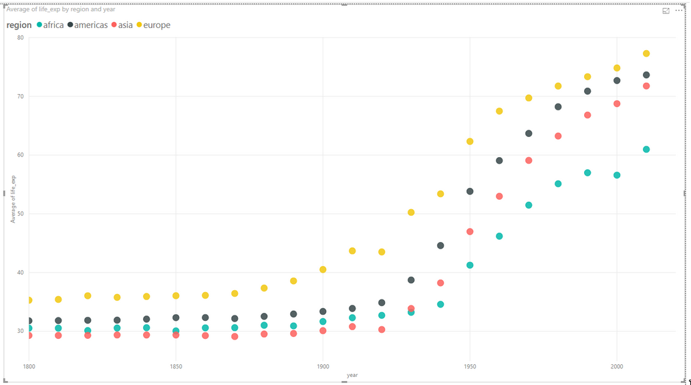
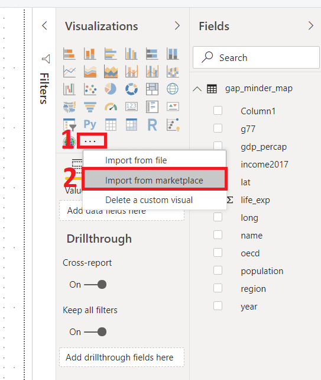

# Plotting

<!--
  ## Import data set
  Load the `gap_minder_map.csv` file in PowerBI desktop

Click on "**Get Data**" dropdown icon, and go to Text/CSV option; a dialog box will appear. 

```{r echo=F,out.width="25%",fig.align="center"}

```

--picture-- 
  
  --picture--
  
  Locate your file and click "**Open**".

--picture--
  
  Another dialog box will appear where you can see the contents of your file. Click on Load icon to "**Load**" the file in your Power BI Desktop.

--picture--
  
  --picture--
  
  --picture--
  
  --picture--
  
  Once you have loaded the file, you will not see the contents automatically. You need to click on "**Edit Query**" icon under the Home tab in the taskbar to visualize the contents of your file. This will open a new window that looks like an Excel sheet.


--TODO
Replace image with gapminder data.
Numerical data has ∑ symbol.
-->
  In the previous chapter, we saw how to import data into Power BI. We also did some basic pre-processing of data like cleaning the data, changing the type of data, dealing with NaN values. In this section, we are going to work with our already processed data.


## Visualizations Panel

We touched upon the different panels present in the Power BI interface. Now, we will explore the different panels dedicated to creating and formatting charts in detail.
One of the panels is the Visualization panel highlighted in the Red box. It contains various types of charts that you can create to visualize your data. Some of the available chart types are- Stacked bar chart, Line chart, Area chart, Scatter chart, Pie chart, etc. You can also import a custom visual from a file or the market-place if you click on **…** icon. We will explore that in the later section. 


<!--picture--->
  ```{r echo=F,out.width="100%",fig.align="center"}
knitr::include_graphics("figures/ch04/visualization_panel.png")
```


### Scatter chart

Let's create our first chart- Scatter plot. The first step to create any plot in Power BI is to select the plot template/type from the visualization panel. So, we click on the scatter chart icon in the visualization panel and drag our data columns to the respective -Axis field as shown in the figure below.

<!--picture--->
```{r echo=F,out.width="60%",fig.align="center"}
knitr::include_graphics("figures/ch04/scatter_plot_1.png")
```

We want the see how life expectancy (life_exp) varies with time (year).
After dragging the columns to their respective fields, we get our first scatter plot.


<!--picture---> 
```{r echo=F,out.width="80%",fig.align="center"}
knitr::include_graphics("figures/ch04/scatter_plot_2.png")
```

The final interface will look like the image below. The plot will be at the left of the visualization panel.

<!--picture--->
```{r echo=F,out.width="100%",fig.align="center"}
knitr::include_graphics("figures/ch04/scatter_plot_3.png")
```

Well, that was simple! In general, this will be the procedure to create any type of plot the Power BI i.e., Select the chart type from the visualization section, drag data to the -Axis fields.

The above scatter plot isn't interesting. Let's explore what other things can we do with this plot.

x-Axis: year
y-Axis: life_exp. Right-click on drop-down button and select "**Don’t summarize**" option.
Legend: By name. Drag name column and place it in legend field.

```{r echo=F,out.width="80%",fig.align="center"}
knitr::include_graphics("figures/ch04/scatter_plot_2_by_country.png")
```

Here, we have colored each dot by the country name. This plot shows the trend of the life expectancy for **each country** with years. Every country is specified by a different color.
Since there are so many countries in our data, this plot looks messy, unclear and our plot legend "explodes".

Can we do better?

Let's see.

Use following parameters to create your chart:
  
  x-Axis: year. Right-click on drop-down button and Select "**Don’t summarize**" option.
y-Axis: life_exp. Right-click on drop-down button and Select "**Don’t summarize**" option.
Legend: By region. 

```{r echo=F,out.width="80%",fig.align="center"}
knitr::include_graphics("figures/ch04/scatter_plot_3_by_region.png")
```

Here, we color each data point by the region in which the countries lie. The `summarize` option summarizes the life expectancy (life_exp) for each region and we don't want that for now.
In general, whether the summarize option is required or not, depends on the question that we ask from the data.

*PowerBI automatically summarizes the numerical data. Always be careful with that.*

**Activity:** In the same chart, try the following:
Size: By population
Report what follows.


### Challenge 1: Summarize data{.challenge}
Create a chart with the following options: 

x-Axis: year
y-Axis: life_exp. Keep the summarize option ON for life_exp. 
Legend: By region

Explain the chart.

Click on the dropdown menu and select "**Average**" and explain the difference.

**Solution1:**
Computes the sum of life_exp in all countries in a given region, and plots it.
Computes the average of life_exp in all countries in a given region, and plots it.


```{r echo=F,out.width="100%",fig.align="center"}

```

### Line Chart

Let's select a line chart from the visualization panel. Drog and drop following columns:
  
  Axis: Year
Values: Life_exp
Legend: By name

```{r echo=F,out.width="80%",fig.align="center"}
knitr::include_graphics("figures/ch04/linechart_life_exp_vs_year_by_name.png")
```

We get differently colored lines for each country. Let's try `by region`. What do we get?

Axis: Year
Values: Average of Life_exp. Select "**Average**"
Legend: By region

```{r echo=F,out.width="80%",fig.align="center"}
knitr::include_graphics("figures/ch04/linechart_avg_life_exp_vs_year_by_region.png")
```

Power BI computes average of Life expectancy for countries in each regions and show 4 lines (Average) corresponding to the 4 regions.


### Bar Plots

Select the bar chart from the Visualization panel and drag the following columns:

Axis: Year
Values: Population 
Legend: By region


```{r echo=F,out.width="80%",fig.align="center"}
knitr::include_graphics("figures/ch04/bar_chart_pop_vs_year_by_region.png")
```

This bar plot shows total population variation over time (in years) partitioned for all 4 regions.

### Trends in scatter plot

```{r echo=F,out.width="80%",fig.align="center"}
knitr::include_graphics("figures/ch04/trend_life_exp_vs_year_by_region.png")
```

### Challenge 2: Scatter Plot {.challenge}
Create a scatter-plot with following information:

gdp_percap as x.
life_exp as y.
population as the size.
region as the label.

```{r echo=F,out.width="80%",fig.align="center"}
knitr::include_graphics("figures/ch04/solution2.png")
```

## Plot modifications

### Filter data: 
Select the last plot you created- life_exp vs gdp_percap. Click on the Filter panel which is adjacent to the Visualization panel. Drag the year column and place it in "**Filter on this page**" bar. 

```{r echo=F,out.width="80%",fig.align="center"}
knitr::include_graphics("figures/ch04/filter1.png")
```

Change the filter type to "**Basic Filtering**" Now you have all the years as a scrolling list. Select any one year and you can see the data for that particular year. For example, if we want to look at this data fro year 2010, select 2010 in the filter panel.

```{r echo=F,out.width="80%",fig.align="center"}
knitr::include_graphics("figures/ch04/filter2.png")
```


### Challenge 3: Filtering {.challenge}

**A.** On the previous plot, create a filter for country names.

**B.** Visualize gdp_percapita vs life_exp for these countries: Kenya, Australia, Chile and Belgium

```{r echo=F,out.width="80%",fig.align="center"}
knitr::include_graphics("figures/ch04/solution3.png")
```

### Beautify plots:

In the Visualization panel, under the chart icons, three separate tabs can be seen. The first one is the "**Fields**" where we drop the data columns. The second icon looks like a paint roller which is to "**Format**" the plots. The third icon that looks like a magnifying glass is for performing "**Analytics**" for example, add a trend line. To beautify the plots, we will be exploring the "**Format**" icon. Let's format the plots with following parameters:
  
  Font- Segoe(Bold)
Font size: 12
Font color: Black

You can edit the font size, face, color of axis lables, legends and titles in the "**Format**" section. 

### Slicer:
In the chart types, locate "**Slicer**". Create a new blank Slicer chart. Drag and drop the `region` column in the data field. We have created a slicer and can visualize data for each region separately. Since Power BI is highly interactive, this slicer is applied to all the charts that we have created and will show the results for selected part in the slicer. You can chose to apply slicer to specific charts by turning it off for other charts.

**How to Turn off slicer??**
  
  ```{r echo=F,out.width="80%",fig.align="center"}
knitr::include_graphics("figures/ch04/slicer.png")
```

### Challenge 4: Slicer {.challenge}

**A.** Create a slicer for country names.

**B.** First visualize for Bangladesh. Then visualize for Bangladesh and Brazil.


```{r echo=F,out.width="80%",fig.align="center"}
knitr::include_graphics("figures/ch04/challenge3c.png")
```

For Bangladesh

```{r echo=F,out.width="80%",fig.align="center"}
knitr::include_graphics("figures/ch04/bangladesh.png")
```

For Bangladesh and Brazil

```{r echo=F,out.width="80%",fig.align="center"}
knitr::include_graphics("figures/ch04/bangladesh_and_brazil.png")
```


## Explore Marketplace for other plot types

Till now, we have seen several different kinds of plots. Power BI comes with these default plots. There are other different kinds of plots are available in the marketplace. To import new plot template from the marketplace, click on the icon "**(...)**", i.e. three horizontal dots in the visualization panel then click on the import from the marketplace.


```{r echo=F,out.width="60%",fig.align="center"}

```


Once you click on Import from marketplace, It will pop a new window, where you can search for various types of templates. For example, we are looking for the Word Cloud template. Type Word Cloud in the search box, once you find the template click on the "**Add icon**" then it will added to the visualization panel. 


```{r echo=F,out.width="100%",fig.align="center"}
knitr::include_graphics("figures/ch04/wordcloud.png")
```


### Challenge 4: Create a WordCloud for countries by GDP per capita {.challenge}

#### WordCloud

a) Create a plot that compares GDP per capita for each country

Category: name
Values: GDP per capita

b) Filter this for the year 2010.

c) Use a slicer with years

```{r echo=F,out.width="100%",fig.align="center"}
knitr::include_graphics("figures/ch04/word_cloud.png")
```

### Map chart
We need Latitude (lat) and Longitude (long) values to create a Map chart. For this, we use following parameters:
  
  Size: Population
Color: Income level

```{r echo=F,out.width="80%",fig.align="center"}
knitr::include_graphics("figures/ch04/geo_map.png")
```

This plot tells us if a country is one of the four- high income, upper-middle income, lower-middle income or low income country by the color of the bubbles. The color correspondence to these categories can be seen in the legend at the top of the chart. It also indicates the population size of each country by the size of bubble. Bigger the bubble, higher the population of the country.