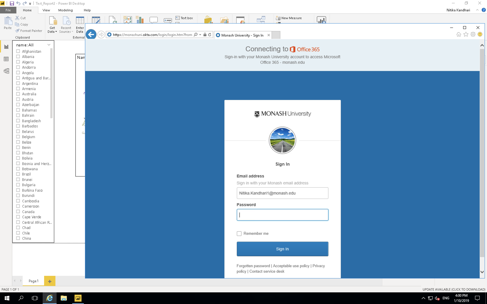

# Saving and Exporting

Now we have visualised our data and created various types of plots. Let’s save our visuals. 
Go to File > Save
Select an appropriate file name and the folder where you want to save it. Click on Save.

```{r echo=F,out.width="100%",fig.align="center"}
knitr::include_graphics("figures/ch05/save.png")
```

The file extension for Power BI files is “.pbix”. The .pbix files are highly compressed file types that contains all the graphics along with the actual data.

*Note: If you share your .pbix file with others, your actual data gets shared as well.*

Now, we want to create a report of our analysis and share it with others. The way it is done in Power BI is to publish the report on the Power BI server.
For this, go to File > Publish > Publish to Power BI

```{r echo=F,out.width="100%",fig.align="center"}
knitr::include_graphics("figures/ch05/publish1.png")
```

After clicking on **“Publish to Power BI”**, you will be prompted to select a destination on the Power BI server where you want to publish your report. The default is **“My workspace”**. You can create different workspaces dedicated to say, different projects, on the server. Let’s select the default option. Click **“Select”**.

```{r echo=F,out.width="100%",fig.align="center"}
knitr::include_graphics("figures/ch05/publish2.png")
```

Now, give it 2-3 mins and then you will see the following on your screen with a success message.

```{r echo=F,out.width="100%",fig.align="center"}
knitr::include_graphics("figures/ch05/publish3.png")
```

The report has been published to your workspace on PoweBI. To access that, click on **“Open “<your_filename.pbix>”** in Power BI”.


```{r echo=F,out.width="100%",fig.align="center"}
knitr::include_graphics("figures/ch05/open_in_server.png")
```

After you click on the link, you will be taken to Power BI’s login through Microsoft. You need to fill in your login credentials. 

```{r echo=F,out.width="100%",fig.align="center"}
knitr::include_graphics("figures/ch05/login_server.png")
```

```{r echo=F,out.width="100%",fig.align="center"}

```

Once you sign in, you will see the Power BI dashboard. Scroll through the tabs on the top- Dashboards, Reports, Workbooks and Datasets. We are interested in the Reports tab because that is where you can find your published report. The different types of actions can be seen under the **“Actions”** tab. These actions include- share, analyze in Excel, quick insights etc. Hover over the different symbols to find out what they do and select the appropriate action.

```{r echo=F,out.width="100%",fig.align="center"}
knitr::include_graphics("figures/ch05/powerbi_dashboard.png")
```

We want to take a look at our report and share with others. Let’s click on the report itself. You will see something like the following:

```{r echo=F,out.width="100%",fig.align="center"}
knitr::include_graphics("figures/ch05/report.png")
```

If you click on “Edit” on the top, you will go in and edit mode and can actually perform everything you did in the Power BI desktop. 

```{r echo=F,out.width="100%",fig.align="center"}
knitr::include_graphics("figures/ch05/edit_report.png")
```

Now, you can see all the Visualization options and fields in the Power BI server. Click on the “Share” button in the top left corner. This allows you to share your report with others. 

```{r echo=F,out.width="100%",fig.align="center"}
knitr::include_graphics("figures/ch05/powerbi_desktop_options.png")
```

# What's next?
We have an intermediate level workshop on Power BI which talks about establishing relational connections between different datasets.

