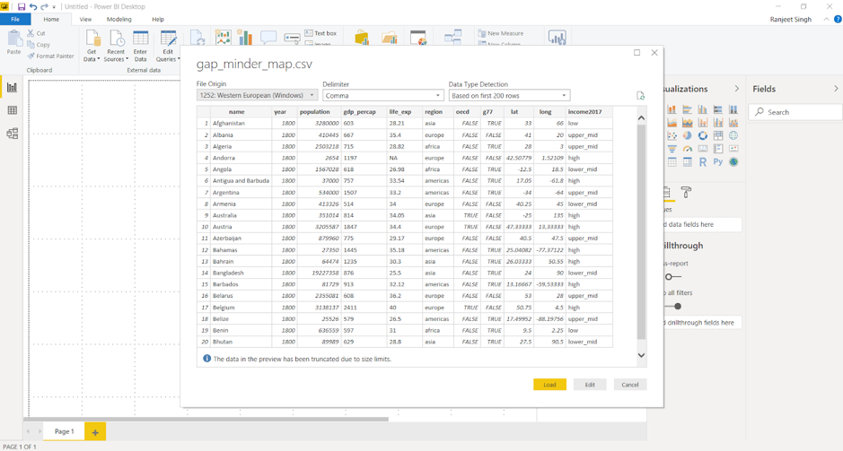
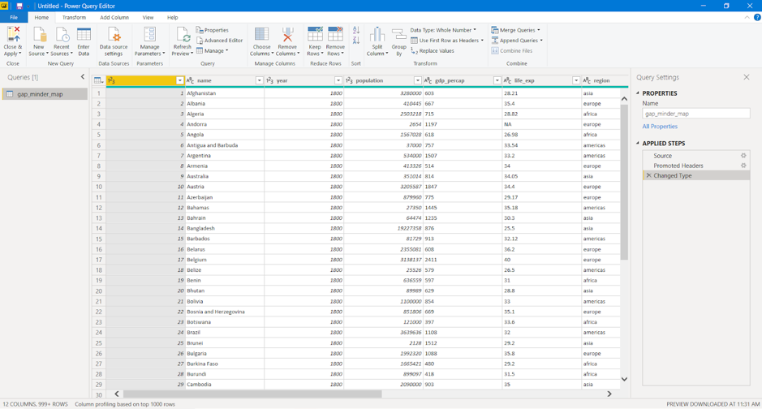

# Import dataset and modelling 

Power BI can connect to a whole range of data sources from Excel sheets and local databases to several Cloud services. Currently, over 60 different cloud services have specific connectors to help you connect with generic sources through XML, CSV, text, and ODBC. 
Let us start connecting to one of the data sources. For today we will be working on the `gap_minder_map.csv` file.

## Importing data into Power BI Desktop

Power BI Desktop has a "**Get Data**" button from the ribbon on the "**Home**" tab. In Power BI, there are all sorts of different data sources available. Select a source to establish a connection. Depending on your selection, you will be asked to find the source on your computer or network, or be prompted to sign in to a service to authenticate your request.

As our first step to import the dataset/file into Power BI, we click on the Get Data icon on the ribbon of Home tab.

Once we select this, we go ahead and select the "**CSV option**" under the "**file**" subheading. 

Then browse the file and select the necessary CSV file. Press on "**Connect**" to have a quick preview of the file. Once we click on "**Load**", Power BI will successfully import the file. Any errors will then pop up ready to be analysed and fixed.

Clicking on "**View errors**" will enable us to check the detected errors right away. Alternatively, close the pop up and click "**Edit queries**" to check for any errors. This will query and list the errors in the data. 

## Dealing with errors

### Check for “controlled” errors

Once queried, we can see the controlled errors in the data. These errors can be analysed by clicking on them. Every error has a brief description to it saying what might have gone wrong.

### Change datatype of column

One of the most common errors is the detection of the datatype of a particular column. While loading the data, Power BI guesses the column type based on the data it sees. If needed the datatypes of the columns can be changed to something relevant.
Double click on the "**datatype**" icon on top of the column, select the "**datatype**" and click on "**Replace current step**".

Any changes to the data needs to be done under the "**Data file**" listed under "**Other Queries**". Once necessary changes are made, it is important to refresh and check if the change was applied. We can do this by clicking on the "**Refresh Preview**" button on the ribbon.

Once all the required changes are done, we can close and apply going back to the main Power BI Desktop interface.

Make sure you see all the column names in the data on the bottom right corner.

### Replacing null values

Data can have missing values for a number of reasons. This missing data is represented as `null` in the data. A lot of times it is important to deal with such values and fix or remove them. 

In the "**Data**" section on the left sidebar, data can be viewed. By applying a filter to a particular column, the null values can be analysed. To replace any null values, we can go back to the "**Query Editor**" and use the “Replace values” option in the **Transform** tab. You can also remove error values by right-clicking a column and selecting the "Remove errors" option.

### Challenge 1: Replace missing values {.challenge}

Use the "Replace values" option on the `gdp_percap` column to replace the blank values.
Use the "Remove errors" option on the `life_exp` column to remove the error values caused by the blanks.\

Replacing missing values is not always a direct operation. Most of the times, the missing values must be carefully analyzed and values need to be computed based on several factors. While this can be done with DAX in Power BI, this is not a key capability of Power BI. Try to clean up and eliminate errors from your data before you import into Power BI. Power BI does ignore blank and error values when it comes to analysis and visualisation but this may not always be the best approach.
Let us cancel these steps in the “Applied steps” by clicking on the red crossmark right next to "**Replaced Value**" and "**Removed Errors**".

## 'Applied steps' in modelling data

### Renaming columns

Columns from raw data can be difficult to read or meaningless. Renaming the columns in your query to a meaningful name will make it easier for you and your audience to understand your data. This will often save you trouble in the future when it comes to working and presenting the data.

There are two ways to rename the columns in Power BI. Right-clicking on the header of the column gives you a menu of functions that you can do to the column. Select "**Rename**" to rename the column. You can also click on the column and then click on the "**Transform**" tab, from here you are presented a variety of transformation functions for the column. From here you can click on "**Rename**".

Example:

* Right-click on the `name` column header, click on "**Rename**" and rename the column to `Country`.
* Click on the header for `life_exp`. Click on the "**Transform**" tab and click rename. Rename the column to `Life expectancy`.

### Add and remove column

#### Removing columns

Often when dealing with raw data you will find columns that are meaningless or unsuitable for your analysis. You can remove these columns in Query to eliminate clutter and streamline the data set making it easier to work with.

There are two ways to remove columns in Power BI. Like in renaming a column, you can right-click the header, which will present a menu with the option to "**Remove**". You can also click on the column, click on the "**Home**" tab and then click "**Remove Columns**".

Example:
You may not need the `g77` and `oecd` information.

* Right-click on the `g77` column header, click on "**Remove**"
* Left-click on `oecd` column header, click on "**Home**" tab, click "**Remove Column**"

#### Adding columns

Just as you would remove unsuitable data from your queries, you may need to add new columns to your data. There are a variety of options in Power BI to add different columns. Click on the "**Add Column**" tab to see the ways you can add a column.

Example:

* Add or subtract a year to the `year` column to fix any widespread issues.
* Click on `gdp_percap`, click on the "**Add Column**" tab, click duplicate to create a separate column to run calculations on.

### Challenge 2: {.challenge}

Perform a simple mathematical operation and add this as a new column.
Let’s say you want to calculate Total Gross Domestic Products (GDP) per country. As Total GDP = Population x GDP per capita, using the new `gdp_percap` column you created in the previous example, create a new column with Total GDP per country.

### Navigating 'applied steps' and undoing

It is important to know what sort of transformations the data has gone through to understand the current state of your data. These steps are listed on the "**Applied Steps**" section on the "**Query Editor**". Sometimes these steps might need to be moved up or down their order based on the required application. These steps can also be removed by clicking on the red crossmark next to the step. This will undo the action it performs and takes back the data to the previous stage.

### Refresh data ready for analysis

Always refresh your data when you are ready to do your analysis and visualisation. Clicking the Refresh option will refresh the data and rerun all your queries. This will show any issues or errors with your data or your queries and ensure that all the data is up to date and ready for analysis.

