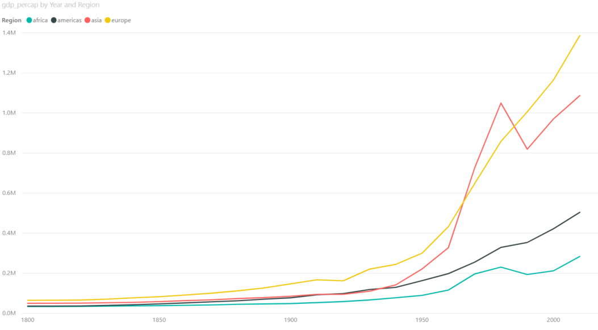

# Plotting

<!--
## Import data set
Load the `gap_minder_map.csv` file in PowerBI desktop

Click on "**Get Data**" dropdown icon, and go to Text/CSV option; a dialog box will appear. 

--picture-- 

--picture--

Locate your file and click "**Open**".

--picture--

Another dialog box will appear where you can see the contents of your file. Click on Load icon to "**Load**" the file in your Power BI Desktop.

--picture--

--picture--

--picture--

--picture--

Once you have loaded the file, you will not see the contents automatically. You need to click on "**Edit Query**" icon under the Home tab in the taskbar to visualize the contents of your file. This will open a new window that looks like an Excel sheet.

--TODO
Replace image with gapminder data.
Numerical data has ∑ symbol.
-->
In the previous chapter, we saw how to import data into Power BI. We also did some basic pre-processing of data like cleaning the data, changing the type of data, and dealing with null and error values. In this section, we are going to work with our already processed data.

## Visualization Panel

We touched upon the different panels present in the Power BI interface. We will now explore the different panels dedicated to creating and formatting charts in detail.
One of the panels is the **Visualization panel** highlighted in the Red box. It contains various types of charts that you can create to visualize your data. Some of the available chart types are - Stacked bar chart, Line chart, Area chart, Scatter plot, Pie chart, etc. You can also import a custom visual from a file or the marketplace if you click on the **…** icon. We will explore that in the later section. 

<!--picture--->

### Scatter plot

Let's create our first chart, a Scatter plot. The first step to plot any kind of plot in Power BI is to select the plot template/type from the **Visualization panel**. Click on the scatter chart icon in the visualization panel and drag the columns to the respective -Axis field as shown in the below figure.

<!--picture--->

We want to see how life expectancy `life_exp` varies with time `year` in years.
After dragging the columns to their respective fields, we get our first scatter plot.
An overall increasing trend can be seen after year 1900.

<!--picture---> 

The final interface will look like the image below. The plot will be at the left of the **Visualization panel**.

<!--picture--->

In general, this will be the procedure to create any type of plot in Power BI i.e. select the chart type from the **Visualization panel** and then drag data to the relevant fields.

The above scatter plot is not informative. Let’s explore what else we can do with this plot.

    X-Axis: year

    Y-Axis: life_exp. Click on drop-down button and select "Don’t summarize" option.

    Legend: By name. Drag name column and place it in legend field.

We have colored each dot by the country. This plot shows the trend of life expectancy for **each country** with years.
Since there are so many countries in our data, this plot looks messy, unclear and our plot legend "explodes".

Let's make this better.

Use the following parameters to create your chart:

    X-Axis: year
    Y-Axis: life_exp. Right-click on drop-down button and de-select "Don’t summarize" option.
    Legend: By region

This plot colors each data point by the region where the country is located. The **summarize** option summarizes the life expectancy `life_exp` for each region.

*PowerBI automatically summarizes the numerical data. Be aware and check this when you add new numerical data to visualization fields.*

**Activity:** In the same chart, try the following:

+ Size: By `population`
+ Report what follows.

### Challenge 1 Scatter plot{.challenge}
Keep the summarize option ON. Create a chart with the following options: 

    X-Axis: year

    Y-Axis: life_exp

    Legend: By region
 
Click on the dropdown menu and select **Average**.

### Challenge 1: Solution {.challenge}

Computes the sum of `life_Exp` in all countries in a given region, and plots it.
Computes the average of `life_Exp` in all countries in a given region, and plots it.

### Bar Plots

Select the bar chart from the **Visualization panel** and drag the following columns:

    Axis: Year
    Values: Population 
    Legend: By region

This bar plot shows population variation over time (in years) for all 4 regions.

### Line Chart

Select a line chart from the **Visualization panel**. Drag and drop the following columns:

    Axis: Year
    Values: Life_exp
    Legend: By name

We get differently colored lines for each country. Now try changing the Legend to `by region`.

    Axis: Year
    Values: Average of Life_exp. Select Average
    Legend: By region

Power BI computes average of Life expectancy for countries in each region and shows four average lines corresponding to four regions.

### Changing visualizations

As you can see from your line chart, this uses the same data as your scatter plot but presented in a different visual format. Instead of making a new seperate visualization to do a different visual style, you can edit and change existing visualizations easily with Power BI. 

For the current line chart, select the visual and try selecting different visualizations on the **Visualization panel**. Visualizations with similar structures to your existing visual, like bar charts, will change over seamlessly. A slightly different visualization like a scatter plot might require some testing with the **Fields** in the **Details** tab. 

Change your line chart to a scatter plot. Drag `life_exp` to the y-axis and `Year` to the x-axis. This should now be identical to your first scatter plot.

As you may have noticed, dragging and dropping **Fields** into the **Details** tab will automatically change the data visualization. You can easily add new and swap fields using the drag and drop to change and discover new ways to visualize your data. You can remove fields by clicking the x next to the name.

### Challenge 2: Line chart {.challenge}
As the line chart is showing the same information as an existing visualization, change the chart to show average GDP per capita instead of average life expectancy.

### Challenge 2: Solution {.challenge}

### Trends and analytics in plots

Up till now we have been working in the **Details** tab of the **Visualizations panel**. There are two other useful tabs, **Format** and **Analytics**. Let's have a look at **Analytics**.

This tab allows you to add different reference lines to your visualization which can help the user determine trends and insights in the data. Click on the scatter plot that you have created. Select the **Analytics** tab.

Here you can add reference lines for various measures. Add a trend line to your chart.

These options will vary depending on the chart that you use.

## Plot modifications

An important aspect of visualizing and telling the story of your data is the design and format of your visualizations. This is where we will use the **Format** tab.

Click on your scatter chart you created for Challenge 2 and click the **Format** tab to see the variety of options available to make your visualization more readable and understandable. 

A common issue is the default titles of charts. This will usually use the names of the data columns which is often meaningless to the average user. 

Click on **Title** and change it to a clearer name like 'Regional average life expectancy since 1800'. 
You can also edit the legend or axis labels. Let's make the axis labels more clear. 
Change the font for the x and y axis to Segoe(Bold), increase the font size to 12 and color to black.

The options available will be different for each visualization. Using these options will greatly increase the engagement and understanding of your visuals.

### Challenge 3: Scatter Plot {.challenge}
Let's say you think there might be a correlation between GDP per capita and life expectancy. Try creating a scatter plot showing the comparison between these two value split by region.

### Challenge 3: Solution {.challenge}
+ `gdp_percap` as x.
+ `life_exp` as y.
+ `region` as the legend.

As you can see, this visualization is messy and confusing. In the next section we will show ways to make this visualization clearer.

## Filters

Filters are a powerful way to break down and show specific parts of the data. You can access the **Filters panel** through clicking **Filters**.

You can filter data for individual visualizations, pages and for the entire report.

Select the scatter plot you created for challenge 3. Click on the **Filter panel** which is adjacent to the **Visualization panel**. Drag the year column and place it in "**Filter on this page**" bar. 

Change the filter type to **Basic Filtering** Now you have all the years as a scrolling list. Select any one year and you can see the data for that particular year. For example, if we want to look at this data from year 2010, select 2010 in the filter panel.

### Challenge 4: Filtering {.challenge}

**A.** On the previous plot, create a filter for country names.

**B.** Visualize `gdp_percapita` vs `life_exp` for these countries: Kenya, Australia, Chile and Belgium

### Challenge 4: Solution {.challenge}

### Slicer:
In the chart types, locate **Slicer**. Create a new blank Slicer chart. Drag and drop the **region** column in the data field. We have created a slicer and can visualize data for each region separately. Since Power BI is highly interactive, this slicer is applied to all the charts that we have created and will show the results for selection in the slicer. You can chose to apply slicer to specific charts by turning it off for other charts. We will cover this in the next section.

Note: Hold the CTRL button to select more than one option.
  
  

### Challenge 5: Slicer {.challenge}

**A.** Create a slicer for country names.

**B.** First visualize for Bangladesh. Then visualize for Bangladesh and Brazil.

### Challenge 5: Solution {.challenge}

For Bangladesh

For Bangladesh and Brazil

## Edit interactions

You may have noticed that clicking on a data point in a visualization will affect other visualizations in the same way as a slicer. Click on a segement in your bar chart to see the effect on other visuals. 

While this interaction is useful in exploring the connections between the relationships shown in one visual to another, there will be cases where you do not want a visualization to change depending on the slicer or what you have selected on a visual. You can edit how these interactions affect your visualisations through **Edit interactions** on the **Format** tab.

Select the **Avg GDP per capita vs Year by Income** line chart. Select **Asia** on the chart legend. Select the **Format** tab and select **Edit interactions**. Several icons will pop up near the other visualizations. These control how the visual will look depending on your interaction with the selected visual.

Selecting **None** will mean that the related visual will not change depending on interactions with the selected visual. Change one of the scatter plots to **None** and select a different data point on the line chart to see the effect.
Select **Asia** on the line chart again. Currently the bar chart highlights the relevant section. Select the filter icon to change  and select another data point on the line chart to see the effect.

Note: existing elements on the page may interfere with the **Edit interactions** icons. Resize and move your visuals to avoid this.

Every visual interacts with all other visuals individually. Check the **Edit interactions** to make sure all your interactions work as expected.

## Explore Marketplace for other visualizations

The visualizations we have been using are part of the default offerings in Power BI. There are more visualisations available in the marketplace. To import a new visualisation template from the marketplace, click on the icon **(...)**, i.e. three horizontal dots in the visualization panel then click on import from the marketplace.

This will pop a new window, where you can search for various types of templates. We are looking for the Word Cloud template. Type Word Cloud in the search box, once you find the template click on the **Add icon**. This will add it to the **Visualization panel**. 

### Challenge 6: Create a Word Cloud for countries by GDP per capita {.challenge}

a) Create a plot that compares GDP per capita for each country

* Category: `name`
* Values: `GDP per capita`
    
b) Filter this for the year 2010.

c) Use a slicer with years

### Challenge 6: Solution {.challenge}

### Map chart
We need Latitude `lat` and Longitude `long` values to create a Map chart. For this, we use the following parameters:

    Size: Population
    Colour: Income level

This plot tells us a country's income level in 2017 - high income, upper-middle income, lower-middle income or low income by the color of the bubbles. These categories can be seen in the legend at the top of the chart. It also indicates the population size of each country by the size of bubble.
