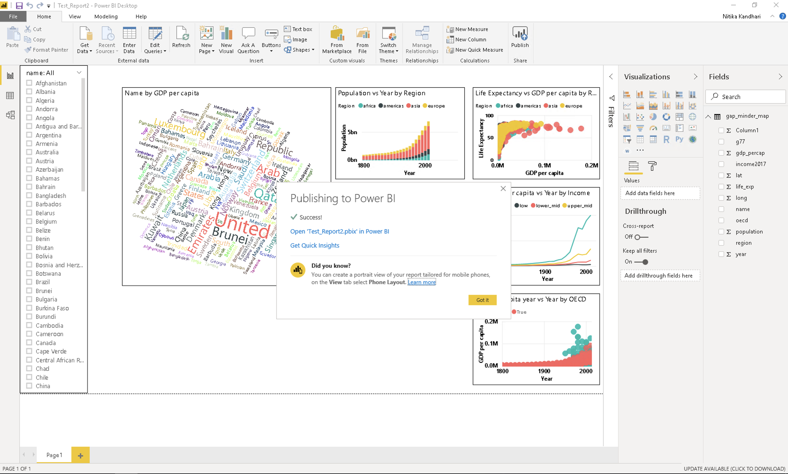
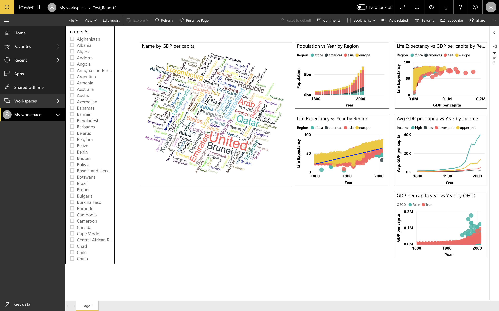

# Saving and Exporting

Now that we have visualised the data and created various types of plots we need to save our visuals. 

## Saving as pbix files

Go to **File > Save**, then choose an appropriate file name and the folder to save it. Click on **Save**.

The file extension for Power BI files is “.pbix”. The .pbix files are highly compressed file types that contains all the graphics along with the actual data.

*Note: If you share your .pbix file with others, your actual data gets shared as well.*

## Exporting and publishing report

Now we want to create a report of our analysis and share it with others. We use Power BI to publish the report on the Power BI server.

To do this, go to **File > Publish > Publish to Power BI**.

After clicking on **Publish to Power BI**, you will be prompted to select a destination on the Power BI server where you want to publish your report. The default setting is **My workspace**. You can create different workspaces dedicated to different projects on the server. Let’s use the default option, and click **Select**.

It takes about 2-3 mins to finalise the report and you will see the following success message on your screen.

Congratulations! The report has been published to your workspace on PowerBI. To access it, click on **Open <YOUR_FILENAME.pbix>** in Power BI.

After you click on the link, you will be taken to Power BI’s login through Microsoft. You need to fill in your login credentials. 

Once you sign in, you will see the Power BI dashboard. Scroll through the tabs on the top - Dashboards, Reports, Workbooks and Datasets. We are interested in the **Reports** tab because that is where you can find your published report. The different types of actions can be seen under the **Actions** tab. These actions include - share, analyze in Excel, quick insights etc. Hover over the different symbols to find out what they do and select the appropriate action.

We want to take a look at our report and share it with others. Let’s click on the report itself. You will see a similar screen showing your report:

If you click on **Edit** on the top, you will be able to edit mode and perform nearly everything you can in the Power BI desktop. 

You can see all the Visualization options and fields in the Power BI server. Click on the **Share** button in the top left corner. This allows you to share your report with others. 

<!--## What's next?

We will also have an intermediate level workshop on Power BI, which is about establishing relational connections between different datasets.-->

